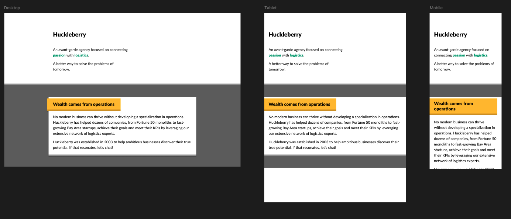

# CSS Hands-On Assignment - Exercise 2

# Description

Convert the design in the image to HTML and CSS. Check this Figma file for pixel-perfect design.


# How to clone the repo
```bash
git clone https://github.com/ekundayoSO/altschool-css-502-2.git
```
# Clone version of design
[View from here](https://css-502-2.web.app)

# Author
```bash
. Sulaimon Ekundayo
```